# 📋 แบบทดสอบระบบตามเกณฑ์ Assignment 2 (10 + 3 คะแนน)
### ระบบ Network Automation UI สไตล์ Packet Tracer (NetConfig Tracer Studio v3)

เอกสารนี้จัดทำขึ้นตามข้อกำหนดโจทย์ **Assignment 2 (10 คะแนน) + โบนัส (3 คะแนน)** เพื่อให้คุณสามารถตรวจสอบ (Verify) การทำงานของทุกฟังก์ชันทีละกรณี (Case-by-Case) ด้วยตนเอง และใช้เป็นเอกสารแนบส่งอาจารย์ผู้ตรวจ

---

## 🎯 สรุปเกณฑ์การให้คะแนนและจับคู่ Test Case (Rubric Mapping)

| หมวดหมู่ตามโจทย์ | ข้อกำหนด | คะแนน | รหัสเคสทดสอบ |
| :--- | :--- | :---: | :---: |
| **1. ระบบการเชื่อมต่อ** | รองรับการเชื่อมต่อ EVE-NG และอุปกรณ์จริง ผ่าน **Serial**, **SSH**, และ **Telnet** | **2.5** | `TC-CONN-01` ถึง `04` |
| **2. การจัดการ Interface** | กำหนด **IP Address**, **Subnet Mask**, สั่ง **Up** (no shut) และ **Down** (shut) | **2.5** | `TC-IF-01` ถึง `05` |
| **3. การทำ Routing** | รองรับ **Static**, **Default Static**, **RIP**, **EIGRP**, **OSPF**, และ **BGP** | **3.0** | `TC-RT-01` ถึง `07` |
| **4. คำสั่ง Show พื้นฐาน** | รันคำสั่ง Show ที่เกี่ยวข้องกับ **Routing** และ **คำสั่งพื้นฐานที่จำเป็น** | **2.0** | `TC-SHOW-01` ถึง `04` |
| **⭐ โบนัส 1: Auto Discovery** | มีระบบ **Auto Discovery** สร้าง Topology เป็นรูปภาพตามการต่อจริง | **+1.5** | `TC-BONUS-TOPO-01` ถึง `03` |
| **⭐ โบนัส 2: รูป Port ทั้งหมด** | มีปุ่มกดดู **รูป Port ทั้งหมด (Front Panel Port Matrix)** พร้อมสถานะ | **+1.5** | `TC-BONUS-PORT-01` ถึง `03` |
| **รวมคะแนนทั้งสิ้น** | **ข้อกำหนดหลัก (10) + โบนัส (3)** | **13** | **รวม 26 Test Cases** |

---

## 🏗️ แผนผังเครือข่ายจำลองสำหรับการทดสอบจริง (Simulated Test Topology Blueprint)
> **ข้อกำหนดโจทย์:** *"โดยสร้าง topo จำลองขึ้นมาและ test ตามข้อความที่โจทต้องการ"*

เพื่อให้ครอบคลุมทุกมิติของการทดสอบตามเกณฑ์ Assignment 2 ระบบได้ออกแบบแผนผังเครือข่ายจำลอง (Simulated Topology Lab) ซึ่งประกอบด้วย **Router 3 ตัว (R1, R2, R3)**, **Layer 2 Switch 1 ตัว (SW1)**, **Linux Client Node 1 ตัว (PC1)** และ **Virtual PC 1 ตัว (PC2)** โดยจำลองสภาพแวดล้อมที่เชื่อมต่อผ่านโปรโตคอลครบทั้ง 3 ชนิด (**SSH**, **Telnet**, และ **Serial COM**)

### 1. ผังการเชื่อมต่อเครือข่ายจำลอง (Mermaid Architecture Diagram)

```mermaid
graph LR
    subgraph LAN_CLIENT ["🏢 Client Subnet (192.168.80.0/24)"]
        PC1["🖥️ PC1 (Ubuntu Linux)<br/>IP: 192.168.80.146/24<br/>Protocol: SSH (Port 22)"]
    end

    subgraph BACKBONE ["🌐 Core Routing Backbone"]
        R1["🧭 R1 (Cisco IOL / AS 65001)<br/>Eth0/0: 192.168.80.138/24 (Mgmt)<br/>Eth0/1: 10.1.12.1/30 (To R2)<br/>Loopback0: 1.1.1.1/32<br/>Protocol: SSH (Port 22)"]
        
        R2["🧭 R2 (Cisco IOL / Transit)<br/>Eth0/0: 192.168.80.135/24 (Mgmt)<br/>Eth0/1: 10.1.12.2/30 (To R1)<br/>Eth0/2: 10.1.23.1/30 (To R3)<br/>Loopback0: 2.2.2.2/32<br/>Protocol: TELNET (Port 23 / 32769)"]
        
        R3["🧭 R3 (Cisco IOL / AS 65002 / Physical)<br/>Eth0/0: 192.168.80.134/24 (Mgmt)<br/>Eth0/1: 10.1.23.2/30 (To R2)<br/>Eth0/2: 10.1.30.1/24 (To SW1)<br/>Loopback0: 3.3.3.3/32<br/>Protocol: SERIAL (COM3) / TELNET"]
    end

    subgraph LAN_BRANCH ["🏬 Branch Subnet (10.1.30.0/24)"]
        SW1["🔀 SW1 (Cisco L2 IOL Switch)<br/>Vlan1: 192.168.80.140/24<br/>Eth0/0-3: Access/Trunk<br/>Protocol: TELNET (Port 23)"]
        PC2["💻 Virtual PC2<br/>IP: 10.1.30.50/24<br/>Gateway: 10.1.30.1 (R3)"]
    end

    PC1 ---|Management Link| R1
    R1 ===|Inter-Router 10.1.12.0/30| R2
    R2 ===|Inter-Router 10.1.23.0/30| R3
    R3 ===|LAN Gateway 10.1.30.0/24| SW1
    SW1 ---|VLAN Access| PC2

    classDef router fill:#1e293b,stroke:#38bdf8,stroke-width:2px,color:#f8fafc;
    classDef switch fill:#1e293b,stroke:#a855f7,stroke-width:2px,color:#f8fafc;
    classDef pc fill:#1e293b,stroke:#10b981,stroke-width:2px,color:#f8fafc;
    class R1,R2,R3 router;
    class SW1 switch;
    class PC1,PC2 pc;
```



---

### 2. ตารางการจัดสรร IP และรายละเอียดการเชื่อมต่อ (IP Addressing & Topology Matrix)

| อุปกรณ์ (Device) | บทบาทในระบบ (Role) | ชนิดอุปกรณ์ | วิธีการเชื่อมต่อ (Protocol) | IP/พอร์ต สำหรับจัดการ (Mgmt Access) | Interface ที่ใช้ทดสอบ | IP Address / Subnet ที่กำหนด | ปลายทางที่เชื่อมต่อ (Connected Neighbor) |
| :--- | :--- | :---: | :---: | :--- | :--- | :--- | :--- |
| **PC1** | Linux Client | Ubuntu 22.04 | **SSH** | `192.168.80.146:22`<br/>(user/Test123) | `ens3` | `192.168.80.146/24` | Switch / Gateway |
| **R1** | Border Gateway (AS 65001) | Cisco IOL L3 | **SSH** (Port 22) | `192.168.80.138:22`<br/>(admin/cisco) | `Ethernet0/1`<br/>`Loopback0` | `10.1.12.1 255.255.255.252`<br/>`1.1.1.1 255.255.255.255` | R2 `Eth0/1`<br/>Router ID |
| **R2** | Core Transit Router | Cisco IOL L3 | **TELNET** (Console/23) | `192.168.80.135:23`<br/>(port 23 / 32769) | `Ethernet0/1`<br/>`Ethernet0/2`<br/>`Loopback0` | `10.1.12.2 255.255.255.252`<br/>`10.1.23.1 255.255.255.252`<br/>`2.2.2.2 255.255.255.255` | R1 `Eth0/1`<br/>R3 `Eth0/1`<br/>Router ID |
| **R3** | Branch Router (AS 65002) | Cisco IOL / Physical | **SERIAL** (COM Port) / Telnet | พอร์ต `COM3` (Baud 9600)<br/>หรือ `192.168.80.134:23` | `Ethernet0/1`<br/>`Ethernet0/2`<br/>`Loopback0` | `10.1.23.2 255.255.255.252`<br/>`10.1.30.1 255.255.255.0`<br/>`3.3.3.3 255.255.255.255` | R2 `Eth0/2`<br/>SW1 `Eth0/0`<br/>Router ID |
| **SW1** | LAN Distribution Switch | Cisco IOL L2 | **TELNET** (Port 23) | `192.168.80.140:23` | `Vlan1`<br/>`Ethernet0/0-3` | `192.168.80.140 255.255.255.0`<br/>L2 Switching | Management / R3 / PC2 |
| **PC2** | Simulated Branch PC | Virtual Node | **Proxy via Gateway** | ผ่าน R3 Gateway | `veth0` | `10.1.30.50 255.255.255.0` | Gateway `10.1.30.1` |

---

### 3. ลำดับขั้นตอนการทดสอบแบบบูรณาการ (End-to-End Test Execution Roadmap)

เมื่อเริ่มต้นทดสอบระบบ ให้ปฏิบัติตามลำดับ 5 ลำดับขั้น (Phases) ดังนี้:

```text
[Phase 1: Connection & Discovery]
  ├── เชื่อมต่อ R1 (SSH)
  ├── เชื่อมต่อ R2 (Telnet)
  ├── เชื่อมต่อ R3 (Serial COM Port)
  ├── เชื่อมต่อ SW1 (Telnet) และ PC1 (Linux SSH)
  └── กด Auto-Discover เพื่อเรนเดอร์ Topology ผังเครือข่ายจำลองแบบ Interactive
        │
        ▼
[Phase 2: Interface Provisioning]
  ├── กำหนด IP 10.1.12.1/30 บน R1 (Eth0/1) และสั่ง Up (no shutdown)
  ├── กำหนด IP 10.1.12.2/30 และ 10.1.23.1/30 บน R2 และสั่ง Up
  ├── กำหนด IP 10.1.23.2/30 และ 10.1.30.1/24 บน R3 และสั่ง Up
  ├── ทดสอบสั่ง Down (shutdown) บนพอร์ตสำรอง เช่น Eth0/3 แล้วสั่ง Up กลับคืน
  └── ทดสอบกำหนดโหมด DHCP Client และโหมด No IP
        │
        ▼
[Phase 3: Routing Protocols Implementation]
  ├── 3.1 Static Route: R1 วิ่งไปเครือข่าย 10.1.30.0/24 ผ่าน Next-Hop 10.1.12.2 (R2)
  ├── 3.2 Default Route: R1 วิ่งออก Internet 0.0.0.0 0.0.0.0 via 192.168.80.1
  ├── 3.3 RIP v2: ประกาศ Network 10.1.12.0 และ 10.1.23.0 ระหว่าง R1 และ R2
  ├── 3.4 EIGRP 100: ประกาศ Network 10.1.23.0 0.0.0.3 ระหว่าง R2 และ R3
  ├── 3.5 OSPF Area 0: ประกาศ Backbone Subnet ระหว่าง R1 - R2
  ├── 3.6 BGP (AS 65001 - 65002): สร้าง Neighbor ข้าม AS ระหว่าง R1 และ R3
  └── ตรวจสอบ Live Cisco IOS Preview ทุกขั้นตอนก่อนกดยืนยัน Deploy
        │
        ▼
[Phase 4: Verification & Show Commands]
  ├── รัน `show ip route` และ `show ip route static` บน R1
  ├── รัน `show ip protocols` ตรวจสอบ Routing Engine ที่ทำงานอยู่
  ├── รัน `show ip ospf neighbor` / `show ip eigrp neighbors` / `show ip bgp summary`
  ├── รัน `show ip interface brief` และ `show running-config`
  └── ทดสอบปุ่ม Copy Terminal Output
        │
        ▼
[Phase 5: Bonus Features Inspection]
  ├── ตรวจสอบการจัดวาง Node, Zoom In/Out บน Interactive Topology Canvas (+1.5 คะแนน)
  └── กดปุ่ม Front Panel บน R1/SW1 ดูโครงหน้ากากเครื่อง ไฟ LED และ Speed ทุกพอร์ต (+1.5 คะแนน)
```

---

# ภาคที่ 1: ข้อกำหนดหลัก (Core Requirements — 10 คะแนน)

---

## 🔌 หมวดที่ 1: ระบบการเชื่อมต่ออุปกรณ์ (Connection System — 2.5 คะแนน)
> **โจทย์กำหนด:** *"ต้องมีระบบเชื่อมต่อเข้ากับอุปกรณ์ (ได้ทั้ง EVE และ อุปกรณ์จริง) ไม่ว่าจะเป็นการต่อ สาย Serial หรือ ได้ทั้ง SSH และ Telnet"*

### [TC-CONN-01] การเชื่อมต่อผ่าน Telnet (EVE-NG Console / Cisco Port 23)
* **วัตถุประสงค์:** ตรวจสอบการเชื่อมต่อไปยังอุปกรณ์ใน EVE-NG ผ่าน Port Telnet Console (เช่น 32769) หรือ Cisco Port 23 จริง
* **ข้อมูลทดสอบ:** อุปกรณ์ `R2` (IP: `192.168.80.135`, Port: `23`) หรือ `SW1` (IP: `192.168.80.140`, Port: `23`)
* **ขั้นตอนการทดสอบ (Steps):**
  1. ไปที่แท็บ **Connect** (แท็บที่ 5)
  2. เลือก Target Device: `R2` (หรือเลือกจาก Inventory)
  3. เลือก Connection Protocol: `TELNET`
  4. ระบุ Port: `23` (หรือ `32769` หากต่อ EVE Console), Password: `cisco`
  5. กดปุ่ม **Connect**
* **ผลลัพธ์ที่คาดหวัง (Expected Result):**
  - [ ] แสดงข้อความสีเขียว: `Connected to R2 (TELNET)`
  - [ ] ในแท็บ **CLI** หน้าจอแสดง Prompt ของอุปกรณ์ เช่น `R2#`
  - [ ] สามารถพิมพ์คำสั่งโต้ตอบได้ทันที

---

### [TC-CONN-02] การเชื่อมต่อผ่าน SSH (Cisco Port 22 & Linux PC)
* **วัตถุประสงค์:** ตรวจสอบการเชื่อมต่อแบบเข้ารหัส SSH บน Cisco Router/Switch และ Linux Ubuntu Node
* **ข้อมูลทดสอบ:** `R1` (IP: `192.168.80.138`, Port: `22`, User: `admin`, Pass: `cisco`) หรือ `PC1` (IP: `192.168.80.146`, Port: `22`, User: `user`, Pass: `Test123`)
* **ขั้นตอนการทดสอบ (Steps):**
  1. ไปที่แท็บ **Connect**
  2. เลือก Device: `R1` (สำหรับ Cisco) หรือ `PC1` (สำหรับ Linux)
  3. เลือก Protocol: `SSH`
  4. กรอก Username และ Password ตามอุปกรณ์
  5. กดปุ่ม **Connect**
* **ผลลัพธ์ที่คาดหวัง (Expected Result):**
  - [ ] แสดงข้อความสีเขียว: `Connected to R1 (SSH)` หรือ `Connected to PC1 (SSH)`
  - [ ] ระบบตรวจจับชนิดอุปกรณ์อัตโนมัติ (Cisco ใช้ driver `cisco_ios`, Linux PC ใช้ driver `linux`)
  - [ ] หน้าต่าง CLI แสดง Prompt พร้อมใช้งาน (`R1#` หรือ `user@user1:~$ `)

---

### [TC-CONN-03] การเชื่อมต่อผ่านสาย Serial (COM Port / สาย Console อุปกรณ์จริง)
* **วัตถุประสงค์:** ตรวจสอบการรองรับการเชื่อมต่อผ่านสาย Console จริง (RS-232 / USB-to-Serial) ด้วย PySerial
* **ข้อมูลทดสอบ:** อุปกรณ์ `R3` หรือเราเตอร์จริงที่ต่อผ่านสาย Serial Adapter
* **ขั้นตอนการทดสอบ (Steps):**
  1. ไปที่แท็บ **Connect**
  2. เลือก Target Device: `R3`
  3. เลือก Protocol: `SERIAL`
  4. หน้าจอจะสลับมาแสดงช่องกรอก **COM Port** (เช่น `COM3` หรือ `/dev/ttyUSB0`) และ **Baud Rate** (เช่น `9600`)
  5. กดปุ่ม **Connect** (หรือหากไม่ได้เสียบสายจริง สามารถทดสอบการสลับฟิลด์และการแจ้งเตือนของระบบได้)
* **ผลลัพธ์ที่คาดหวัง (Expected Result):**
  - [ ] ฟอร์มแสดงช่องกรอก COM Port และ Baud Rate (9600, 115200, 38400) ถูกต้อง
  - [ ] มีระบบดักจับและแจ้งเตือนพอร์ต Serial อย่างถูกต้องตามมาตรฐาน

---

### [TC-CONN-04] การทดสอบยิง Ping และการตั้งค่า SSH Wizard
* **วัตถุประสงค์:** ตรวจสอบความพร้อมของเครือข่ายก่อนเชื่อมต่อ และมีตัวช่วยเปิด SSH บนอุปกรณ์ Cisco อัตโนมัติ
* **ขั้นตอนการทดสอบ (Steps):**
  1. ในแท็บ Connect พิมพ์ IP `192.168.80.138` (R1) แล้วกดปุ่ม **Test Ping**
  2. ในส่วน **SSH Setup Wizard** ด้านล่าง ระบุ Domain: `lab.local`, Key: `2048` แล้วกดรัน
* **ผลลัพธ์ที่คาดหวัง (Expected Result):**
  - [ ] ผลการ Ping แสดงสถานะ `Host is reachable` พร้อมค่า RTT
  - [ ] SSH Wizard สร้าง RSA key บนอุปกรณ์ผ่าน Telnet ได้สำเร็จ

---

## 🛠️ หมวดที่ 2: การจัดการ Interface (Interface Configuration — 2.5 คะแนน)
> **โจทย์กำหนด:** *"สามารถกำหนด IP Address กำหนด การ Up, Down ของ. Interface"*

### [TC-IF-01] การดึงตารางสถานะ Interface ล่าสุดจากอุปกรณ์จริง
* **วัตถุประสงค์:** ตรวจสอบการดึงข้อมูล Interface จากอุปกรณ์ (`show ip int brief` หรือ `ip -br addr`) มาแสดงบน UI
* **ขั้นตอนการทดสอบ (Steps):**
  1. เลือก Target Device: `R1` (เชื่อมต่อแล้ว)
  2. ไปที่ **Tab 1: Interface**
  3. กดปุ่ม **Refresh** เหนือตาราง
* **ผลลัพธ์ที่คาดหวัง (Expected Result):**
  - [ ] ตาราง Interface แสดงรายชื่อพอร์ตจริง (เช่น `Ethernet0/0`, `Ethernet0/1`, `Loopback0`)
  - [ ] แสดงค่า IP Address, Subnet Mask, สถานะ Status (`up`/`down`), และ Protocol (`up`/`down`)
  - [ ] เมื่อสลับไปที่ `PC1` แสดงพอร์ต Linux เช่น `ens3`, `lo` พร้อม IP `/24`

---

### [TC-IF-02] การสั่งเปิดพอร์ต Up (no shutdown) ผ่าน UI
* **วัตถุประสงค์:** ตรวจสอบการกดปุ่มสั่งเปิดใช้งาน Interface จากหน้าต่าง UI โดยตรง
* **ขั้นตอนการทดสอบ (Steps):**
  1. ในตาราง Interface คลิกเลือกแถวพอร์ตที่ต้องการเปิด (เช่น `Ethernet0/1` หรือ `Loopback0`)
  2. ที่ส่วน **Step 2:** กดปุ่มสีเขียว **Up**
* **ผลลัพธ์ที่คาดหวัง (Expected Result):**
  - [ ] ระบบส่งคำสั่ง `interface <name>` ตามด้วย `no shutdown` เข้าไปยังอุปกรณ์
  - [ ] มีข้อความแจ้งเตือนสีเขียวว่าสั่ง Up สำเร็จ
  - [ ] กด Refresh แล้วสถานะ Status และ Protocol ของพอร์ตเปลี่ยนเป็น `up`

---

### [TC-IF-03] การสั่งปิดพอร์ต Down (shutdown) ผ่าน UI
* **วัตถุประสงค์:** ตรวจสอบการกดปุ่มสั่งปิดการทำงานของ Interface
* **ขั้นตอนการทดสอบ (Steps):**
  1. คลิกเลือกพอร์ตสำรองในตาราง เช่น `Ethernet0/3`
  2. ที่ส่วน **Step 2:** กดปุ่มสีแดง **Down**
* **ผลลัพธ์ที่คาดหวัง (Expected Result):**
  - [ ] ระบบส่งคำสั่ง `shutdown` ไปยังอุปกรณ์
  - [ ] มีข้อความแจ้งเตือนสีแดงว่าสั่ง Down สำเร็จ
  - [ ] กด Refresh แล้วสถานะของพอร์ตเปลี่ยนเป็น `administratively down`

---

### [TC-IF-04] การกำหนด Static IP Address และ Subnet Mask พร้อมดู Preview
* **วัตถุประสงค์:** ตรวจสอบการกรอกฟอร์มเพื่อกำหนด IP Address และ Subnet Mask ลงใน Interface
* **ขั้นตอนการทดสอบ (Steps):**
  1. เลือก Interface จาก Dropdown เช่น `Ethernet0/1` บน `R1`
  2. เลือกโหมด: `Static IP`
  3. กรอก IP Address: `10.1.12.1`
  4. กรอก Subnet Mask: `255.255.255.252`
  5. กรอก Description (ถ้ามี): `Link-to-R2`
  6. สังเกตกล่อง **Cisco IOS Preview**
  7. กดปุ่ม **Deploy Interface Config**
* **ผลลัพธ์ที่คาดหวัง (Expected Result):**
  - [ ] กล่อง Preview แสดงโค้ด:
    ```cisco
    interface Ethernet0/1
     description Link-to-R2
     ip address 10.1.12.1 255.255.255.252
     no shutdown
    ```
  - [ ] ระบบ Deploy คำสั่งลงอุปกรณ์จริงสำเร็จ และตาราง Interface แสดง IP `10.1.12.1`

---

### [TC-IF-05] การกำหนดโหมด DHCP Client และการเคลียร์ IP (No IP)
* **วัตถุประสงค์:** ตรวจสอบการสั่งให้พอร์ตรับ IP อัตโนมัติจาก DHCP Server หรือลบ IP ทิ้ง
* **ขั้นตอนการทดสอบ (Steps):**
  1. เลือก Interface แล้วเลือกโหมด `DHCP Client` → สังเกต Preview แสดง `ip address dhcp`
  2. เลือกโหมด `No IP` → สังเกต Preview แสดง `no ip address`
  3. กดปุ่ม Deploy
* **ผลลัพธ์ที่คาดหวัง (Expected Result):**
  - [ ] อุปกรณ์รับคำสั่งและเปลี่ยนโหมดการทำงานของ Interface ได้ถูกต้อง

---

## 🧭 หมวดที่ 3: ระบบการทำ Routing Protocols (Routing Wizard — 3.0 คะแนน)
> **โจทย์กำหนด:** *"สามารถทำ Routing เช่น RIP, EIGRP, OSPF, BGP, Static และ Default Static Route ได้"*

### [TC-RT-01] การตั้งค่า Static Route
* **วัตถุประสงค์:** ตรวจสอบการสร้างเส้นทางแบบกำหนดเอง (Static Routing) จาก R1 ไปยังเครือข่ายปลายทางของ R3
* **ขั้นตอนการทดสอบ (Steps):**
  1. เลือก Target Device: `R1` แล้วไปที่ **Tab 2: Routing**
  2. เลือกประเภท: **Static**
  3. กรอก Destination Network: `10.1.30.0`
  4. กรอก Subnet Mask: `255.255.255.0`
  5. กรอก Next-Hop IP: `10.1.12.2` (IP ของ R2)
  6. ดู Preview: `ip route 10.1.30.0 255.255.255.0 10.1.12.2`
  7. กดปุ่ม **Deploy Routing Config**
* **ผลลัพธ์ที่คาดหวัง (Expected Result):**
  - [ ] ส่งคำสั่งไปยังอุปกรณ์สำเร็จ
  - [ ] เมื่อรันคำสั่ง `show ip route static` พบเส้นทาง `S  10.1.30.0/24 [1/0] via 10.1.12.2`

---

### [TC-RT-02] การตั้งค่า Default Static Route
* **วัตถุประสงค์:** ตรวจสอบการสร้างเส้นทาง Default Route (`0.0.0.0 0.0.0.0`) เพื่อออก Internet/ภายนอก
* **ขั้นตอนการทดสอบ (Steps):**
  1. เลือกประเภท: **Default**
  2. กรอก Next-Hop IP: `192.168.80.1` (หรือ Exit Interface เช่น `Ethernet0/0`)
  3. ดู Preview: `ip route 0.0.0.0 0.0.0.0 192.168.80.1`
  4. กดปุ่ม **Deploy Routing Config**
* **ผลลัพธ์ที่คาดหวัง (Expected Result):**
  - [ ] ส่งคำสั่งสำเร็จ
  - [ ] เมื่อดู `show ip route` พบข้อความ `Gateway of last resort is 192.168.80.1 to network 0.0.0.0`

---

### [TC-RT-03] การตั้งค่า RIP (Routing Information Protocol v1 / v2)
* **วัตถุประสงค์:** ตรวจสอบการตั้งค่า RIP Version 2 พร้อมการประกาศ Network และคำสั่ง `no auto-summary`
* **ขั้นตอนการทดสอบ (Steps):**
  1. เลือกประเภท: **RIP**
  2. เลือก RIP Version: `Version 2 (classless + VLSM)`
  3. กด `+ Add Network` เพื่อเพิ่มเครือข่าย `10.1.12.0` และ `1.1.1.1`
  4. ดู Preview:
     ```cisco
     router rip
      version 2
      no auto-summary
      network 10.1.12.0
      network 1.1.1.1
     ```
  5. กดปุ่ม **Deploy Routing Config**
* **ผลลัพธ์ที่คาดหวัง (Expected Result):**
  - [ ] คอนฟิกเข้าอุปกรณ์สำเร็จ เมื่อรัน `show ip protocols` จะพบ Routing Protocol is "rip"

---

### [TC-RT-04] การตั้งค่า EIGRP (Enhanced Interior Gateway Routing Protocol)
* **วัตถุประสงค์:** ตรวจสอบการคอนฟิก EIGRP ด้วย Autonomous System (AS) และ Wildcard Mask
* **ขั้นตอนการทดสอบ (Steps):**
  1. สลับ Target Device ไปที่ `R2` แล้วเลือกแท็บ **Routing**
  2. เลือกประเภท: **EIGRP**
  3. กำหนด AS Number: `100`
  4. กด `+ Add Network` แล้วระบุ Network: `10.1.23.0`, Wildcard: `0.0.0.3`
  5. ดู Preview:
     ```cisco
     router eigrp 100
      no auto-summary
      network 10.1.23.0 0.0.0.3
     ```
  6. กดปุ่ม **Deploy Routing Config**
* **ผลลัพธ์ที่คาดหวัง (Expected Result):**
  - [ ] ส่งคำสั่งเข้าอุปกรณ์สำเร็จ สามารถตรวจสอบสถานะได้ผ่าน `show ip eigrp neighbors`

---

### [TC-RT-05] การตั้งค่า OSPF (Open Shortest Path First)
* **วัตถุประสงค์:** ตรวจสอบการคอนฟิก OSPF พร้อม Process ID, Router ID, และ Area
* **ขั้นตอนการทดสอบ (Steps):**
  1. สลับ Target Device ไปที่ `R1` แล้วเลือกแท็บ **Routing**
  2. เลือกประเภท: **OSPF**
  3. กำหนด Process ID: `1`, Router-ID: `1.1.1.1`
  4. กด `+ Add Network`: Network: `10.1.12.0`, Wildcard: `0.0.0.3`, Area: `0`
  5. ดู Preview:
     ```cisco
     router ospf 1
      router-id 1.1.1.1
      network 10.1.12.0 0.0.0.3 area 0
     ```
  6. กดปุ่ม **Deploy Routing Config**
* **ผลลัพธ์ที่คาดหวัง (Expected Result):**
  - [ ] ส่งคำสั่งสำเร็จ ตรวจสอบผ่าน `show ip ospf neighbor` พบ OSPF Adjacency กับเพื่อนบ้านสำเร็จ

---

### [TC-RT-06] การตั้งค่า BGP (Border Gateway Protocol)
* **วัตถุประสงค์:** ตรวจสอบการคอนฟิก External/Internal BGP Neighbor และการประกาศ Route ข้าม AS
* **ขั้นตอนการทดสอบ (Steps):**
  1. บน `R1` เลือกประเภท: **BGP**
  2. กำหนด Local AS Number: `65001`, Router-ID: `1.1.1.1`
  3. กด `+ Add Neighbor`: Neighbor IP: `10.1.12.2`, Remote AS: `65002`
  4. กด `+ Add Network`: Network: `1.1.1.1`, Mask: `255.255.255.255`
  5. ดู Preview:
     ```cisco
     router bgp 65001
      bgp router-id 1.1.1.1
      neighbor 10.1.12.2 remote-as 65002
      network 1.1.1.1 mask 255.255.255.255
     ```
  6. กดปุ่ม **Deploy Routing Config**
* **ผลลัพธ์ที่คาดหวัง (Expected Result):**
  - [ ] อุปกรณ์รับคำสั่ง BGP สำเร็จ ตรวจสอบผ่าน `show ip bgp summary`

---

### [TC-RT-07] การตรวจสอบ Live CLI Preview แบบ Real-Time
* **วัตถุประสงค์:** ตรวจสอบว่าทุกครั้งที่มีการพิมพ์หรือแก้ฟอร์ม Routing กล่อง Preview จะสะท้อนคำสั่ง Cisco ทันที
* **ขั้นตอนการทดสอบ (Steps):**
  1. สลับเลือกประเภท Routing ใดๆ แล้วลองพิมพ์ตัวเลขในช่อง Network หรือ Next-Hop
* **ผลลัพธ์ที่คาดหวัง (Expected Result):**
  - [ ] ข้อความในกล่อง `<pre id="routing-cli-preview">` อัปเดตทันทีแบบ Real-Time ตามที่พิมพ์

---

## 📋 หมวดที่ 4: คำสั่ง Show พื้นฐานที่เกี่ยวข้องกับ Routing (Show Commands — 2.0 คะแนน)
> **โจทย์กำหนด:** *"สามารถ Show คำสั่งพื้นฐาน ที่เกี่ยวของกับการทำ Routing แล คำสั่งที่จำเป็นได้"*

### [TC-SHOW-01] คำสั่ง Show พื้นฐานด้าน Routing
* **วัตถุประสงค์:** ทดสอบการกดปุ่ม Show คำสั่งยอดนิยมเกี่ยวกับตาราง Routing
* **ขั้นตอนการทดสอบ (Steps):**
  1. ไปที่ **Tab 3: Show**
  2. ในหัวข้อ **Routing** กดปุ่ม:
     - `ip route` (`show ip route`)
     - `route static` (`show ip route static`)
     - `ip protocols` (`show ip protocols`)
* **ผลลัพธ์ที่คาดหวัง (Expected Result):**
  - [ ] กล่อง Output ด้านล่างแสดงตาราง Routing Table พร้อมรหัส C, S, R, O, D, B ชัดเจน ไม่ค้าง

---

### [TC-SHOW-02] คำสั่ง Show เฉพาะทางของแต่ละ Protocol (RIP / EIGRP / OSPF / BGP / CDP)
* **วัตถุประสงค์:** ทดสอบคำสั่ง Show เชิงลึกของแต่ละโปรโตคอล
* **ขั้นตอนการทดสอบ (Steps):**
  1. ในหน้า Tab 3 ทดสอบกดปุ่มในแถว Protocols:
     - `rip database` (`show ip rip database`)
     - `eigrp neighbors` (`show ip eigrp neighbors`)
     - `eigrp topology` (`show ip eigrp topology`)
     - `ospf neighbor` (`show ip ospf neighbor`)
     - `ospf database` (`show ip ospf database`)
     - `bgp summary` (`show ip bgp summary`)
     - `cdp neighbors` (`show cdp neighbors detail`)
* **ผลลัพธ์ที่คาดหวัง (Expected Result):**
  - [ ] หน้าต่าง Terminal Output แสดงผลลัพธ์อย่างถูกต้องตาม Protocol ที่ทำงานอยู่บนอุปกรณ์

---

### [TC-SHOW-03] คำสั่ง Show พื้นฐานที่จำเป็นสำหรับอุปกรณ์ (Essential Commands)
* **วัตถุประสงค์:** ทดสอบคำสั่งตรวจสอบสถานะทั่วไปและการตั้งค่าของอุปกรณ์
* **ขั้นตอนการทดสอบ (Steps):**
  1. ในหมวด **General** กดปุ่ม:
     - `ip int brief` (`show ip interface brief`)
     - `int status` (`show interfaces status`)
     - `running-config` (`show running-config`)
     - `version` (`show version`)
     - `vlan` (`show vlan` หรือ `show vlan brief`)
* **ผลลัพธ์ที่คาดหวัง (Expected Result):**
  - [ ] ผลลัพธ์แสดงคอนฟิกปัจจุบัน, เวอร์ชันระบบปฏิบัติการ, และตาราง VLAN อย่างครบถ้วน

---

### [TC-SHOW-04] การคัดลอกผลลัพธ์ (Copy Terminal Output)
* **วัตถุประสงค์:** ตรวจสอบปุ่ม Copy เพื่อนำผลลัพธ์ของคำสั่ง Show ไปใช้งานต่อ
* **ขั้นตอนการทดสอบ (Steps):**
  1. รันคำสั่ง Show ใดๆ
  2. กดปุ่มไอคอนกระดาษ (Copy) ที่มุมขวาบนของกล่อง Output
  3. ทดสอบนำไปวาง (Ctrl+V) ในโปรแกรม Text Editor
* **ผลลัพธ์ที่คาดหวัง (Expected Result):**
  - [ ] ข้อความถูกคัดลอกลง Clipboard ครบถ้วนทุกบรรทัด

---

# ภาคที่ 2: คะแนนโบนัสพิเศษ (Bonus Features — 3 คะแนน)

---

## 🌐 หมวดที่ 5: ระบบ Auto Discovery & Interactive Topology Canvas (+1.5 คะแนน)
> **โจทย์กำหนด:** *"โบนัส (3 คะแนน) ให้มี ระบบ Auto Discovery สร้าง Topology และแสดงผลให้เป็นเป็นรูปภาพ ตามการต่อของเรา"*

### [TC-BONUS-TOPO-01] การแสดงผลผังเครือข่ายเป็นรูปภาพแบบ Interactive (vis-network)
* **วัตถุประสงค์:** ตรวจสอบว่าแผง Topology แสดง Node และ Link เป็นรูปผังเครือข่ายกราฟิกตามที่เชื่อมต่อจริง
* **ขั้นตอนการทดสอบ (Steps):**
  1. มองที่กรอบซ้ายบน **Network Topology**
  2. สังเกตตัว Node: ไอคอนแยกชัดเจนระหว่าง Router, Switch, และ PC
  3. ใช้เมาส์คลิกลาก Node ไปมาเพื่อจัดวางตำแหน่ง
  4. หมุนล้อเมาส์ (Scroll Wheel) เพื่อย่อ/ขยาย (Zoom In / Zoom Out)
* **ผลลัพธ์ที่คาดหวัง (Expected Result):**
  - [ ] ผังเครือข่ายแสดงเป็นกราฟิกรูปภาพ Interactive สวยงาม เคลื่อนไหวตามเมาส์ได้สมูท

---

### [TC-BONUS-TOPO-02] ระบบ Auto-Discovery ค้นหาและสร้าง Topology อัตโนมัติ
* **วัตถุประสงค์:** ตรวจสอบการส่งคำสั่ง CDP / ARP และการดึงข้อมูลจาก EVE-NG เพื่อสร้างเส้นเชื่อมโยง (Links) อัตโนมัติ
* **ขั้นตอนการทดสอบ (Steps):**
  1. กดปุ่ม **Auto-Discover** บน Navbar ด้านบน (หรือกดปุ่ม EVE-NG เพื่อ Import Lab)
  2. สังเกต Badge แสดงจำนวน Devices และ Links ด้านบนของการ์ด
* **ผลลัพธ์ที่คาดหวัง (Expected Result):**
  - [ ] ระบบสร้างเส้นเชื่อม (Links) ระหว่าง Router และ Switch ตามการเชื่อมต่อจริงในระบบโดยอัตโนมัติ

---

### [TC-BONUS-TOPO-03] การคลิกเลือกอุปกรณ์บนแผนผัง (Interactive Node Focus)
* **วัตถุประสงค์:** ตรวจสอบการเชื่อมโยงระหว่าง Topology Canvas กับระบบควบคุม
* **ขั้นตอนการทดสอบ (Steps):**
  1. ใช้เมาส์คลิกที่ตัว Node ใดๆ เช่น `R1` หรือ `SW1` บนผัง Topology
* **ผลลัพธ์ที่คาดหวัง (Expected Result):**
  - [ ] กล่อง **Target Device** ด้านล่างจะสลับไปเลือกอุปกรณ์นั้นโดยอัตโนมัติ พร้อมอัปเดตข้อมูลในแท็บทันที

---

## 🖲️ หมวดที่ 6: รูปแสดง Port ทั้งหมดของอุปกรณ์ (Front Panel Port Matrix — +1.5 คะแนน)
> **โจทย์กำหนด:** *"และ ให้สามารถกดปุ่มเข้าไป แล้วสามารถเห็นรูป Port ทั้งหมด (ตามที่เราได้เขียนโปรแกรมก่อนหน้านี้ ได้)"*

### [TC-BONUS-PORT-01] การกดปุ่มเปิดดูหน้าต่าง Port ทั้งหมด (Front Panel Modal)
* **วัตถุประสงค์:** ตรวจสอบการกดปุ่มเพื่อเปิดหน้าต่างแสดงรูปหน้ากากเครื่องและพอร์ตทั้งหมด
* **ขั้นตอนการทดสอบ (Steps):**
  1. เลือกอุปกรณ์เป้าหมาย (เช่น `R1` หรือ `SW1`)
  2. ใต้ผัง Topology กดปุ่ม **Front Panel** (ไอคอนชิปไมโครโพรเซสเซอร์)
* **ผลลัพธ์ที่คาดหวัง (Expected Result):**
  - [ ] โมดัล **Device Front Panel** เด้งขึ้นมากลางหน้าจออย่างสวยงาม

---

### [TC-BONUS-PORT-02] การแสดงผลรูป Chassis หน้าปัดและไฟ LED สถานะ
* **วัตถุประสงค์:** ตรวจสอบความเสมือนจริงของแผงหน้ากากอุปกรณ์ Cisco
* **ขั้นตอนการทดสอบ (Steps):**
  1. ตรวจสอบบริเวณหัวแผง Chassis ด้านใน Modal
* **ผลลัพธ์ที่คาดหวัง (Expected Result):**
  - [ ] แสดงโลโก้ **CISCO** และชื่อรุ่นอุปกรณ์ (เช่น Cisco Router / Switch)
  - [ ] แสดงไฟ LED แสดงสถานะระบบ **SYS**, **ACT**, **PWR** เรืองแสงสีเขียว

---

### [TC-BONUS-PORT-03] การแสดงช่อง Port ทั้งหมดและตารางรายละเอียดพอร์ต
* **วัตถุประสงค์:** ตรวจสอบการแสดงช่องเสียบสายและข้อมูล Speed, IP, Status ของทุกพอร์ต
* **ขั้นตอนการทดสอบ (Steps):**
  1. สังเกตบล็อก **Ports Matrix** ที่จำลองช่องเสียบสาย (RJ-45 / SFP) ตามพอร์ตจริงของเครื่อง
  2. เลื่อนดูตาราง **Interface Detail** ด้านล่าง
* **ผลลัพธ์ที่คาดหวัง (Expected Result):**
  - [ ] แสดงรูปพอร์ตทั้งหมดของอุปกรณ์ตรงตามโครงสร้างฮาร์ดแวร์
  - [ ] ตารางระบุชื่อ Interface, ชนิดพอร์ต, สถานะ Up/Down, IP Address, Subnet Mask, และ Speed ชัดเจน

---

# ภาคที่ 3: ฟังก์ชันเสริมระดับพรีเมียม (Bonus Plus / Extra Features)

| รหัสเคส | ชื่อฟังก์ชันเสริม | รายละเอียดการทดสอบ | ผลการทดสอบ |
| :---: | :--- | :--- | :---: |
| `TC-EXTRA-01` | **Interactive CLI Terminal** | จำลองหน้าจอ PuTTY/TeraTerm รองรับ Help `?`, Tab Auto-complete, และ History `↑/↓` | `[ ] PASS` |
| `TC-EXTRA-02` | **Sudo Password Masking** | ซ่อนรหัสผ่านขณะพิมพ์ `sudo` บน Linux PC ป้องกันรหัสผ่านหลุด และส่งรหัสให้ sudo สำเร็จ | `[ ] PASS` |
| `TC-EXTRA-03` | **Config Lifecycle Management** | เมนูดาวน์โหลด Export Running/Startup Config (.txt) และปุ่ม Write Memory บันทึกลง NVRAM | `[ ] PASS` |
| `TC-EXTRA-04` | **Cloudflare Public Tunnel** | เปิดให้เข้าใช้งาน Web App จากภายนอกเครือข่ายผ่าน URL HTTPS ของ Cloudflare โดยไม่ต้อง Forward Port | `[ ] PASS` |

---

## 📊 ใบบันทึกคะแนนและประเมินผลการทดสอบ (Evaluation Scorecard)

| หัวข้อตามเกณฑ์การให้คะแนน | คะแนนเต็ม | คะแนนที่ได้ | ผลการทดสอบรวม | ผู้ตรวจ |
| :--- | :---: | :---: | :---: | :---: |
| **1. ระบบเชื่อมต่ออุปกรณ์ (Serial / SSH / Telnet)** | 2.5 | _____ | `[ ] PASS / [ ] FAIL` | |
| **2. การจัดการ Interface (IP / Subnet / Up / Down)** | 2.5 | _____ | `[ ] PASS / [ ] FAIL` | |
| **3. การทำ Routing (Static, Default, RIP, EIGRP, OSPF, BGP)** | 3.0 | _____ | `[ ] PASS / [ ] FAIL` | |
| **4. คำสั่ง Show พื้นฐาน (Routing & Essential)** | 2.0 | _____ | `[ ] PASS / [ ] FAIL` | |
| **⭐ โบนัส 1: Auto Discovery Topology แสดงเป็นภาพ** | 1.5 | _____ | `[ ] PASS / [ ] FAIL` | |
| **⭐ โบนัส 2: ปุ่มกดดูรูป Port ทั้งหมด (Front Panel)** | 1.5 | _____ | `[ ] PASS / [ ] FAIL` | |
| **รวมคะแนนทั้งสิ้น (Total Score)** | **13.0** | **_____** | `[ ] ผ่านเกณฑ์สมบูรณ์` | |
